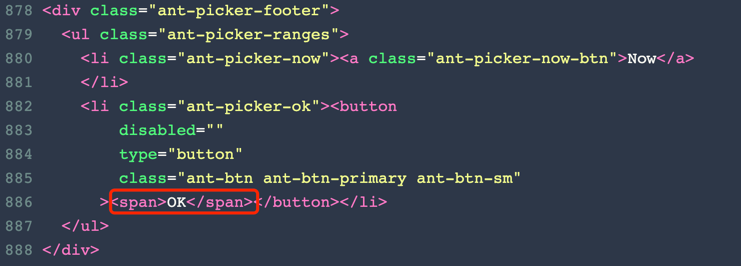

---

title: 前端测试问题

author: xs

date: '2022-09-28'

---
# Q1 问题模版
## 问题简述
前端在对航运信息中的日历的组件的确认按钮的点击的模拟，
报错无法找到目标。


## 问题复现
> 前端代码
```js

describe('ShippingInfo', () => {
  it('should can not choose time before now ', async () => {
    // given
    const formatTime = '2022-09-26 14:00';

    // when
    render(<ShippingInfo onChange={jest.fn()} />);

    await userEvent.type(screen.getByRole('textbox', {
      name: /航运时效/i,
    }), `${formatTime}`);

    await userEvent.click(screen.getByText(/确 认/i));

    // then
    await waitFor(() => {
      expect(screen.getByText('无效日期')).toBeInTheDocument();
    });
  });
});
```

> 报错内容信息

```text
Unable to find an element with the text: /确 认/i. This could be because the text is broken up by multiple elements. In this case, you can provide a function for your text matcher to make your matcher more flexible.

Ignored nodes: comments, <script />, <style />...

```

## 问题排查

- 参考Testing-library官网的API:`https://testing-library.com/docs/queries/about/#screendebug`
- 重要debug的API：
    - screen.debug() 将页面元素打印在控制台上
    - screen.logTestingPlaygroundURL() 将页面元素以URL的方式显示

> URL打印的页面

- 页面中确认按钮的英语化为OK,所以无法获取该元素


## 解决方法

- 将`await userEvent.click(screen.getByText(/确 认/i));`修改为
  `await userEvent.click(screen.getByText(/OK/i));`即可

## 问题回顾

- 对于React组件的测试中可能会存在，在电脑浏览器中页面元素的名字为中文，而在Testing-library中渲染后为英语问题 
- 同时我们应该尽量避免对写这样对组件内部行为的测试，而是传入组件属性，方法进行测试，前端也要尽可能遵守三层分离的方式开发


