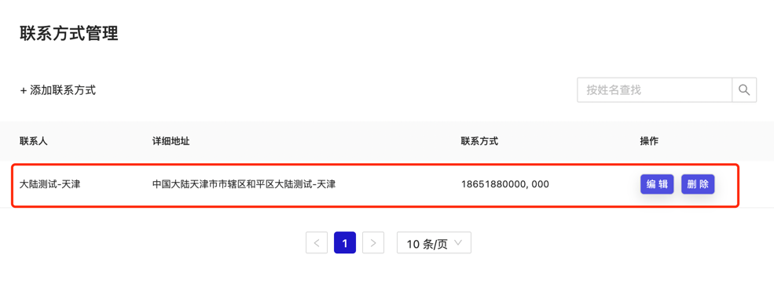
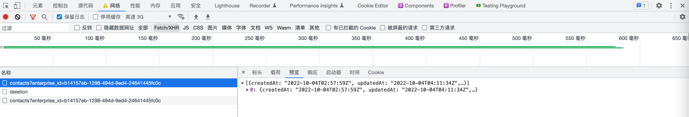
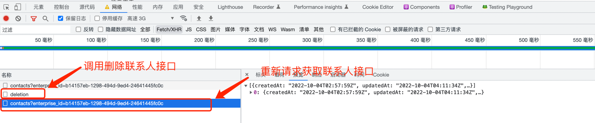
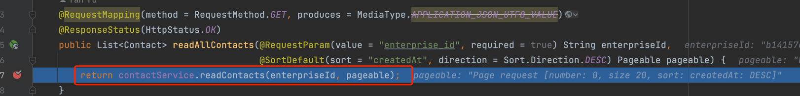
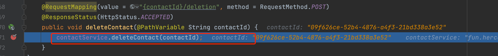
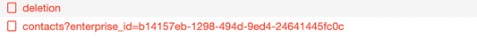
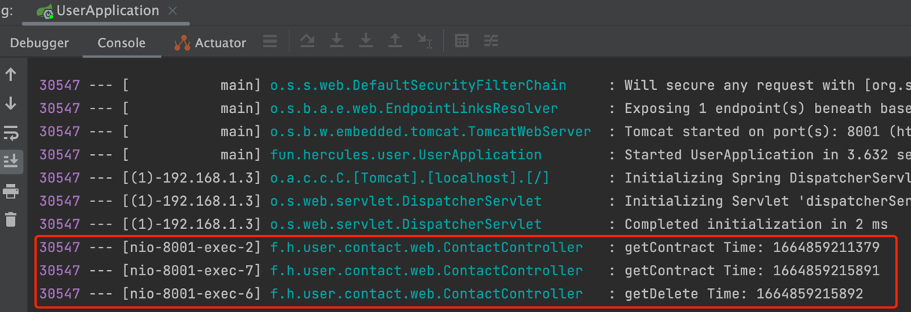

---

title: 联系人刷新失效问题

---
# Q2 问题
## 问题简述
前端在对航运信息中联系进行编辑,删除操作后,进行获取联系人列表查询并不是最新列表问题。

## 问题复现

> 点击编辑或者删除按钮并进行编辑删除操作

- 页面无法正常刷新出最新的联系人列表



## 问题排查

> 查看控制台接口请求信息

- 第一次获取联系人列表接口(接口返回一条联系人信息)



- 第二次获取联系人列表接口(接口依然返回一条联系人信息)




## 推测和思路

> ~~JPA一级缓存问题~~

- JPA默认开启一级缓存，在一个Session对话中，进行查询1-更新-查询2，同时查询查询2查询的是查询1的值，
必须要显示使用注解在更新操作处更新缓存
- 排除该种情况，因为这里是3个请求，并非是在一个请求中进行处理

> 请求异步请求问题

- 对两个接口使用线程模式打上断点，再进行一次删除操作

- 发现在IDEA中先进行请求查询联系人接口


- 再请求进行删除操作


- 前端控制台上对接口调用顺序是 删除后再查询


- 我们再加一个接口调用前加一个日志：发现调用顺序还真是 查询1-查询2-更新


> 查看前端调用逻辑

- updateContact，deleteContact 调用更新和删除接口
- handleGetContacts 调用查询接口
```javascript
 const handleEditContact = (contact) => {
    updateContact(currentContact.id, contact).then(() => {
      setEditContactDialogVisible(false);
    });
    handleGetContacts();
  };

  const handleDeleteContact = () => {
    deleteContact(currentContact.id).then(() => {
      setDeleteContactDialogVisible(false);
    });
    handleGetContacts();
  };
```

- 仔细看一下handleGetContacts调用逻辑，这里仿佛是一个异步调用

```javascript
  const handleGetContacts = useCallback(() => {
    getContacts()
      .then((data) => {
        setContacts(data);
        setLoading(false);
      })
      .catch(() => { setLoading(false); });
  }, []);
```

## 解决方法

- 异步执行改成串行执行就OK了

```javascript
  const handleEditContact = (contact) => {
    updateContact(currentContact.id, contact).then(() => {
      setEditContactDialogVisible(false);
      handleGetContacts();
    });
  };

  const handleDeleteContact = () => {
    deleteContact(currentContact.id).then(() => {
      setDeleteContactDialogVisible(false);
      handleGetContacts();
    });
  };

```

